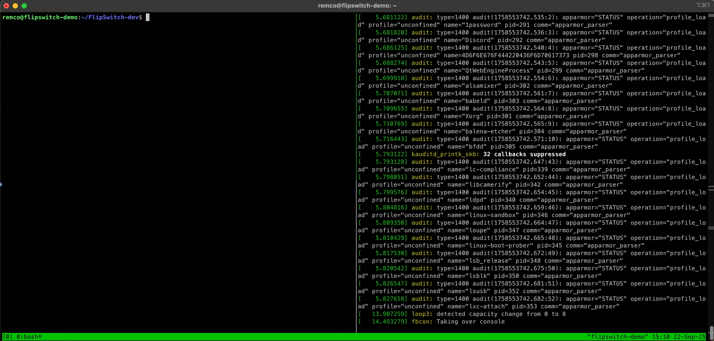

# FlipSwitch - Modern Linux Kernel Syscall Hooking

**A proof-of-concept demonstrating advanced syscall hooking techniques in modern Linux kernels (6.9+)**

*Supporting research for "Unmasking the unseen: a deep dive into modern Linux rootkits and their detection" - VirusBulletin 2025, Berlin*

## Research Background

This project demonstrates a novel syscall hooking technique that adapts to fundamental changes in the Linux kernel architecture introduced in version 6.9. Traditional rootkit techniques relied on direct syscall table manipulation, but modern kernels have moved to a switch-statement based dispatch mechanism.

### The Kernel 6.9+ Challenge

In kernel 6.9, Linux changed from array-based syscall dispatch to switch-statement based dispatch:

**Old approach (pre-6.9):**
```c
// Direct array lookup
sys_call_table[__NR_kill](regs);
```

**New approach (6.9+):**
```c
#define __SYSCALL(nr, sym) case nr: return __x64_##sym(regs);
long x64_sys_call(const struct pt_regs *regs, unsigned int nr)
{
    switch (nr) {
    #include <asm/syscalls_64.h>
    default: return __x64_sys_ni_syscall(regs);
    }
}
```

### FlipSwitch Approach

While the syscall table still exists for compatibility:
```c
/*
 * The sys_call_table[] is no longer used for system calls, but
 * kernel/trace/trace_syscalls.c still wants to know the system
 * call address.
 */
#define __SYSCALL(nr, sym) __x64_##sym,
const sys_call_ptr_t sys_call_table[] = {
#include <asm/syscalls_64.h>
};
```

**FlipSwitch** leverages this by:
1. Finding the target syscall address in the legacy `sys_call_table`
2. Scanning the `x64_sys_call` function for call instructions (0xe8)
3. Identifying unique call offsets that match our target syscall
4. Patching the call instruction to redirect to our hook

Since we're literally "flipping" bytes in a switch statement, we named it **FlipSwitch**.

## Features

### Core Hooking Mechanism

FlipSwitch is designed to work with modern Linux kernels (6.9+) that use a switch-statement for syscall dispatch. Instead of modifying the syscall table, it locates and patches specific call instructions inside the kernel's dispatch function. This approach allows for precise and reliable hooking, and all changes are fully reverted when the module is unloaded.
**Note:** As this is a Proof-Of-Concept designed for research purposes only, it will _only_ work on kernels 6.9+ and only on x64 architectures.

### Simple Obfuscation Pipeline

FlipSwitch includes a basic obfuscation pipeline, mainly to support discussion points in our paper and presentation. The approach is intentionally simple and not intended to provide strong evasion. We perform function name replacement because kernel modules cannot have all symbols stripped. Additionally, we apply basic string obfuscation and metadata randomization to demonstrate common techniques, but these are minimal and for research illustration only.


## Project Structure

```
FlipSwitch/
├── src/                    # Core Implementation
│   ├── main.c             # FlipSwitch hooking engine
│   └── main.h             # Function prototypes and definitions
├── scripts/               # Obfuscation Toolkit
│   ├── func_obfuscate.py          # Symbol name randomization
│   ├── obfuscate_and_replace.py   # String encryption
│   └── randomize_metadata.py      # Metadata falsification
├── build/                 # Build Outputs
│   ├── main.ko           # Standard build
│   ├── main_debug.ko     # Debug build
│   └── main_obf.ko       # Fully obfuscated build
├── Makefile              # Intelligent build system
└── README.md            # This documentation
```

## Quick Start



### Basic Usage
```bash
# Build and test standard version
make test

# Build with debug information
make debug-test

# Build fully obfuscated version
make obfuscate-test

# Compare build sizes
make size-compare
```

### Build Targets
- `make` - Build optimized module (no debug)
- `make debug` - Build module with debug information
- `make test` - Build and test optimized module
- `make debug-test` - Build and test debug module
- `make obfuscate` - Build fully obfuscated module (no debug)
- `make obfuscate-test` - Build and test obfuscated module
- `make clean` - Clean all build artifacts
- `make size-compare` - Compare sizes of different builds
- `make help` - Show this help


## Obfuscation Techniques

Below are examples illustrating how FlipSwitch's simple obfuscation pipeline transforms code and metadata for research purposes:

**Function Obfuscation:**
The Python script scans the header file for function declarations that have the `//obfuscate` tag at the end of the line. For each tagged function, it generates a macro that maps the original function name to a randomly generated name. By including these macros at the top of the C source files, the compiler automatically replaces all occurrences of the original function names with their obfuscated counterparts during compilation.

```c
// Original
static int __init flipswitch_init(void)

// Obfuscated
static int __init f_m3x9k7q2(void)
```

**String Obfuscation:**
The `O_STRING` marco is used by the python scripts to find and replace strings that need to be obfuscated.
```c
// Original
find_sym_pointer(O_STRING("prepare_creds"))

// Obfuscated
find_sym_pointer(deobfuscate(OBF_PREPARE_CREDS, OBF_PREPARE_CREDS_LEN, OBF_PREPARE_CREDS_KEY))
```

**Metadata Randomization:**
```
Original: "FlipSwitch" by "Remco Sprooten"
Obfuscated: "kern_utils_55" by "Blake Wilson"
```
##  Responsible Disclosure

This research is conducted for:
- **Educational purposes** - Understanding modern rootkit techniques
- **Defensive research** - Improving detection capabilities  
- **Academic contribution** - Advancing cybersecurity knowledge

**Not intended for malicious use.** This code demonstrates vulnerabilities for research and defensive purposes only.

##  VirusBulletin 2025 Presentation

**Talk**: "Unmasking the unseen: a deep dive into modern Linux rootkits and their detection"  
**Date**: Friday, September 26, 10:00-10:30  
**Location**: Green Room, Berlin  
**Speakers**: Ruben Groenewoud & Remco Sprooten (Elastic Security Labs)

This project supports research into modern Linux rootkit evolution and detection strategies, providing practical examples of how attackers adapt to kernel security improvements.

## Citation

When referencing this research:

```
Sprooten, R. & Groenewoud, R. (2025). FlipSwitch: Modern Linux Kernel Syscall Hooking 
Techniques. VirusBulletin Conference, Berlin. Elastic Security Labs.
```
